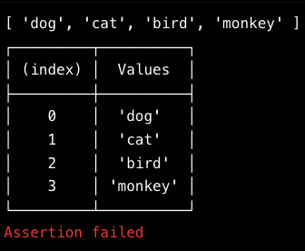

node REPL Read Eval Print Loop
require('module').builtinModules

const petsArray = ['dog', 'cat', 'bird', 'monkey'];

console.log(petsArray)\
console.table(petsArray)\
console.assert(petsArray.length > 5)

process.memoryUsage().headUsed
process.argv[2] --> node app.js sillyMode (gets sillyMode)

require('os') --> type, arch, networkInterfaces, homedir, hostname, uptime
const os = require('os')
const server = {type:os.type(),architecture:os.arch(),uptime:os.uptime()}
console.log(server)

// Require in trails module from trails.js
const trails = require('./trails.js');
// Require util module here!
const util = require('util');

// Simulate database call to search trails module for specified trail
const getTrailDistance = (trail, callback) => {
  return setTimeout(() => {
    if (trails.hasOwnProperty(trail)) {    
      const foundTrail = trails[trail];    
      callback(null, foundTrail)
    } else {
      callback(new Error('Trail not found!'))
    }
  }, 1000);
}

// Callback function to send an error in the case of an error, or to handle trail data if a trail was found successfully.
function callback (error, trailData) {
  if (error) {
    console.error(error.message)
    process.exit(1)
  } else {
    const mi = trailData.miles;   
    const nickname = trailData.nickname;
    console.log(`The ${nickname} is ${mi} miles long!`)
  }
}

getTrailDistance('North Country', callback)

// Promisfy below!
const getTrailDistancePromise = util.promisify(getTrailDistance);

getTrailDistancePromise('North Country')
  .then((foundTrail) => {      
    const nickname = foundTrail.nickname;
    const mi = foundTrail.miles; 
    console.log(`The ${nickname} is ${mi} miles long!`);
  })
  .catch((error) => {
    console.log('Trail not found!', error);
  })

## Events

let a = (data) => {console.log(`Celebrate ${data}`)
let myEmitter = new events.EventEmitter()
myEmitter.on('c', a)
myEmitter.emit('c', 'goot times, come on!')
